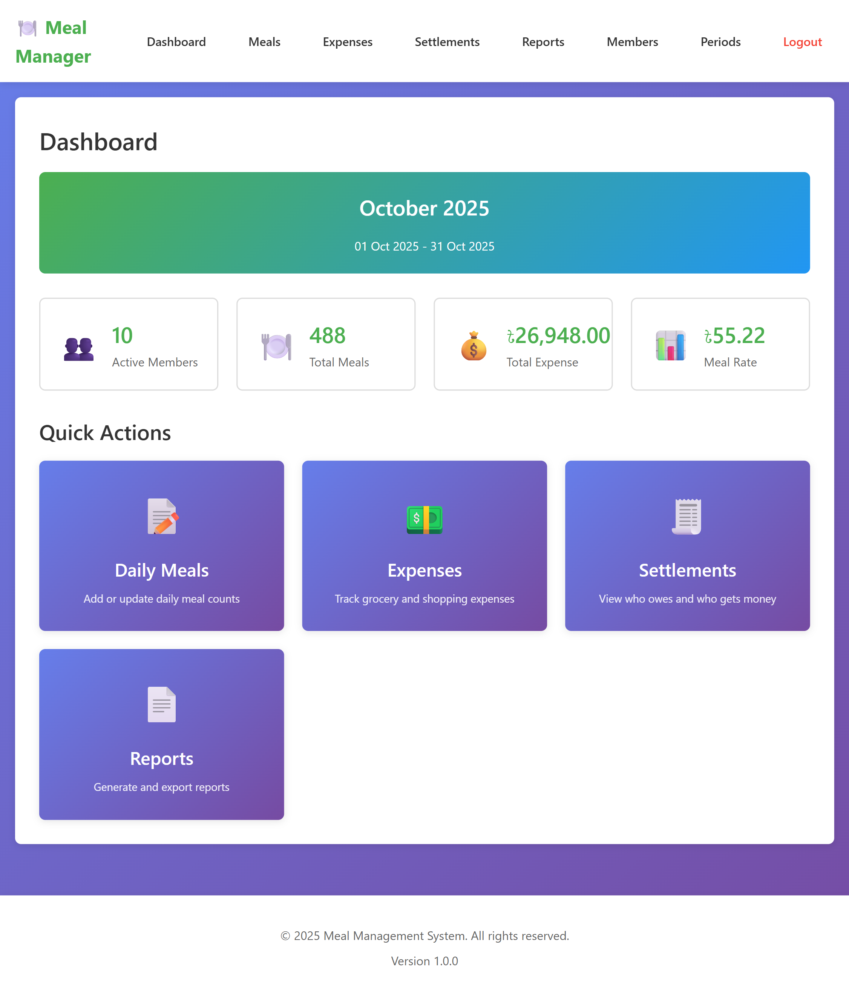
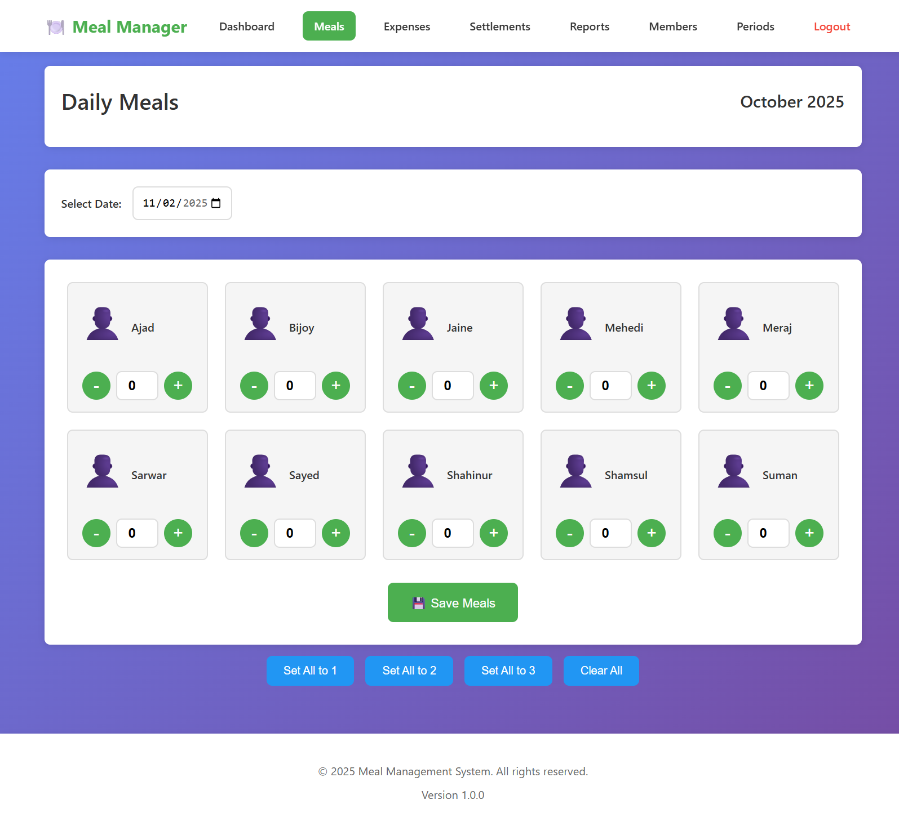
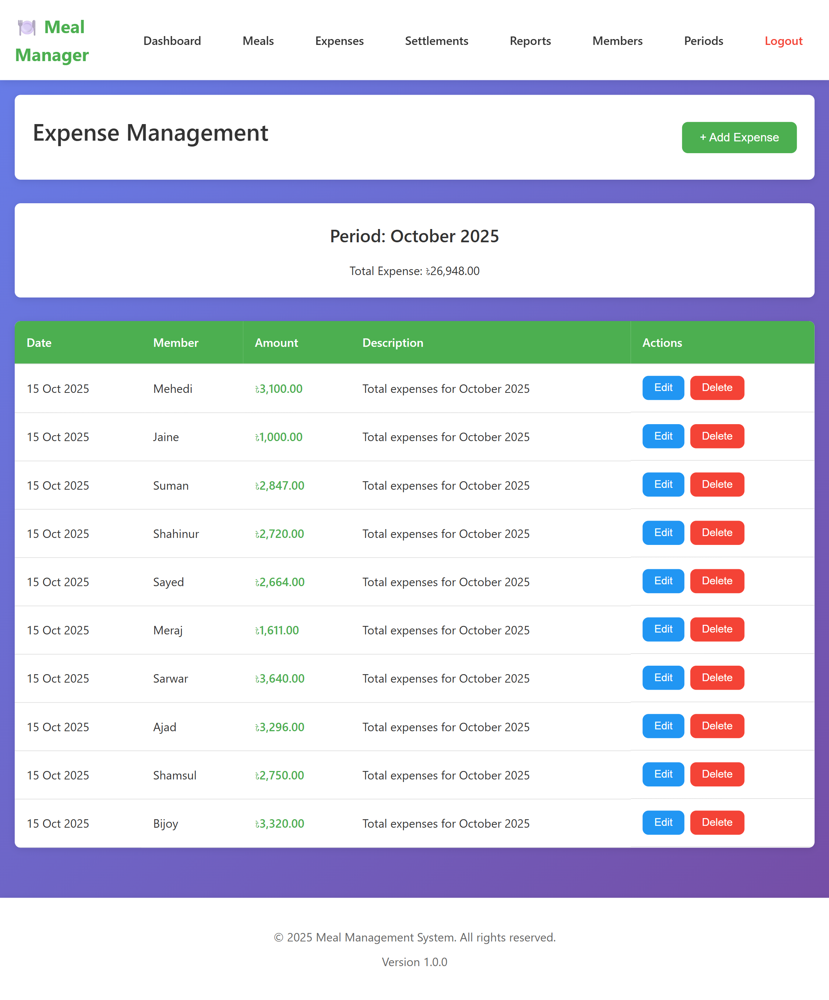
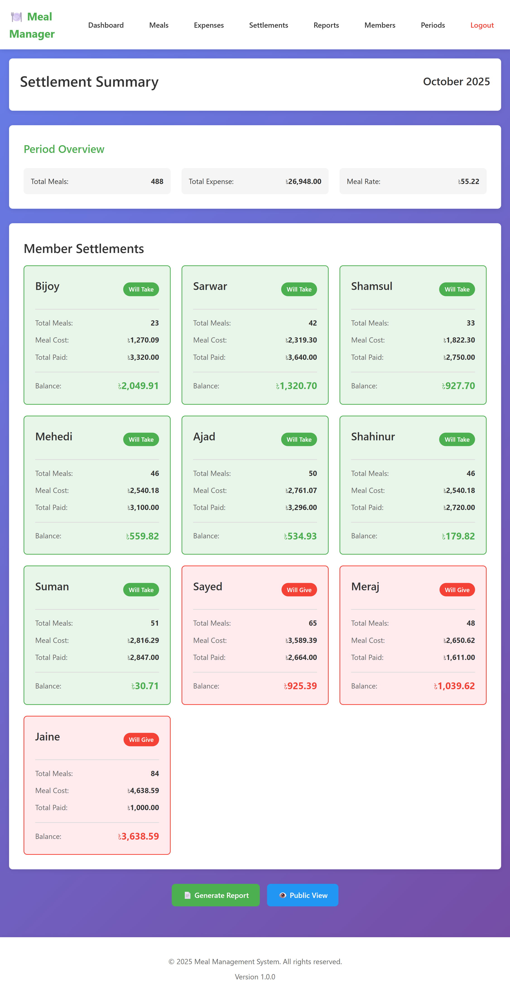
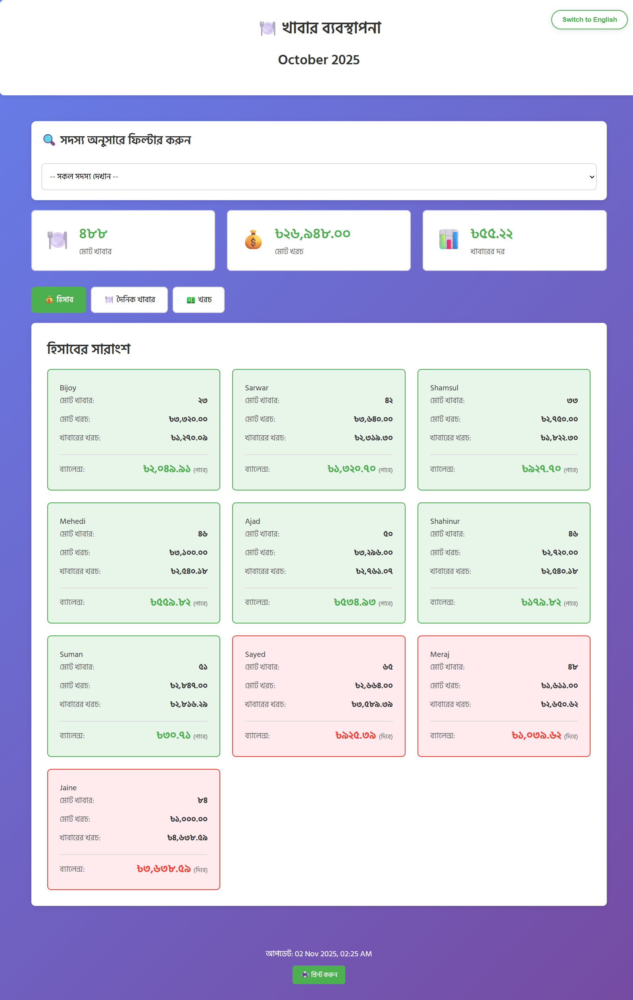
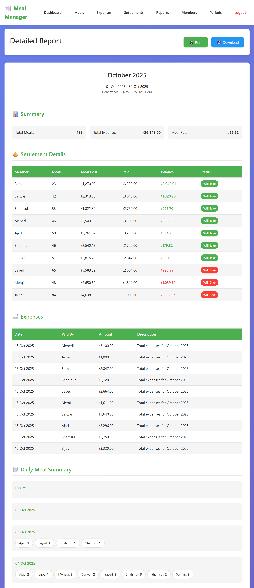
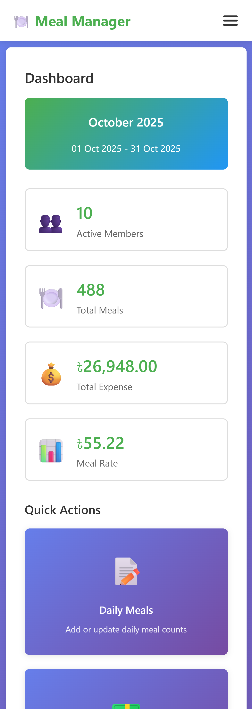

# 🍽️ Meal Management System

<div align="center">


**A modern, mobile-friendly web application for managing shared meal expenses and settlements**

Perfect for hostels, shared accommodations, and group living situations

[Features](#-features) • [Demo](#-screenshots) • [Installation](#-installation) • [Usage](#-usage) • [Documentation](#-documentation)

</div>

---

## 📖 Table of Contents

- [Overview](#-overview)
- [Features](#-features)
- [Screenshots](#-screenshots)
- [Technology Stack](#-technology-stack)
- [Installation](#-installation)
- [Configuration](#-configuration)
- [Usage Guide](#-usage-guide)
- [Database Structure](#-database-structure)
- [API & Functions](#-api--functions)
- [Deployment](#-deployment)
- [Contributing](#-contributing)
- [License](#-license)
- [Support](#-support)

---

## 🌟 Overview

The **Meal Management System** is a comprehensive web application designed to simplify the management of shared meals, expenses, and financial settlements among group members. Built with PHP and MySQL, it features a beautiful, mobile-responsive interface with multilingual support (Bangla/English).

### 🎯 Perfect For:
- 🏠 Hostels and dormitories
- 👨‍👩‍👧‍👦 Shared apartments and houses
- 🏢 Office cafeterias
- 👥 Any group living situation

---

## ✨ Features

### 🔐 **Admin Management**
- ✅ Secure authentication system
- ✅ Complete CRUD operations for all data
- ✅ Member management (add, edit, deactivate)
- ✅ Meal period management (monthly periods)
- ✅ **Period-based member management** (assign members per period)
- ✅ Edit period details (name, dates)
- ✅ Comprehensive dashboard with statistics

### 🍽️ **Meal Tracking**
- ✅ Daily meal entry with intuitive +/- buttons
- ✅ Quick actions (Set All, Clear All)
- ✅ Date picker for any day
- ✅ Visual meal counter
- ✅ Mobile-optimized interface

### 💰 **Expense Management**
- ✅ Add expenses with date and description
- ✅ Track who paid what and when
- ✅ Edit and delete expenses
- ✅ Expense history view
- ✅ Automatic total calculations

### 🧮 **Smart Calculations**
- ✅ Automatic meal rate calculation
- ✅ Fair cost distribution
- ✅ Real-time settlement updates
- ✅ Accurate to 2 decimal places
- ✅ Color-coded balances (green = take, red = give)

### 📊 **Reporting**
- ✅ Comprehensive reports with all details
- ✅ Settlement summaries
- ✅ Expense breakdowns
- ✅ Daily meal records
- ✅ Print/PDF export functionality

### 👁️ **Public View (No Login Required)**
- ✅ Share link with all members
- ✅ View settlements and balances
- ✅ Date-wise meal records
- ✅ Expense history
- ✅ Member filter option
- ✅ **Bilingual support (Bangla/English)**
- ✅ Print-friendly format

### 🎨 **Modern UI/UX**
- ✅ Beautiful gradient designs
- ✅ Card-based layouts
- ✅ Smooth animations
- ✅ Responsive design (mobile, tablet, desktop)
- ✅ Touch-friendly interfaces
- ✅ Dark mode support (optional)

### 🌐 **Multilingual**
- ✅ **Default: Bangla** (বাংলা)
- ✅ Switch to English with one click
- ✅ Bangla numbers (০১২৩৪৫৬৭৮৯)
- ✅ Translated dates and weekdays
- ✅ Complete UI translation

### 📱 **Additional Features**
- ✅ CSV data import
- ✅ WhatsApp sharing ready
- ✅ Screenshot-friendly reports
- ✅ Member-wise filtering
- ✅ Period-wise data management
- ✅ Secure password hashing

---

## 📸 Screenshots

### Dashboard

*Main dashboard with statistics and quick actions*

### Daily Meal Tracking

*Easy meal entry with +/- buttons*

### Expense Management

*Track all expenses with dates and descriptions*

### Settlements

*Color-coded settlement cards showing who owes/gets money*

### Public View (Bangla)

*Public view in Bangla with language switcher*

### Reports

*Comprehensive reports for sharing*

### Mobile Responsive

*Perfectly optimized for mobile devices*

---

## 🛠️ Technology Stack

| Technology | Purpose |
|------------|---------|
| **PHP 7.4+** | Backend server-side logic |
| **MySQL 5.7+** | Database management |
| **HTML5** | Structure and markup |
| **CSS3** | Styling and animations |
| **JavaScript** | Interactive features |
| **AJAX** | Asynchronous operations |

### Key Components:
- 💾 **Database**: MySQL with optimized queries
- 🔒 **Security**: Password hashing, SQL injection prevention
- 🎨 **UI Framework**: Custom CSS with gradient designs
- 📱 **Responsive**: Mobile-first approach
- 🌐 **Fonts**: Google Fonts (Hind Siliguri for Bangla)

---

## 📦 Installation

### Prerequisites

- **PHP** >= 7.4
- **MySQL** >= 5.7
- **Apache/Nginx** web server
- **XAMPP/WAMP** (for local development)

### Quick Setup

1. **Clone the Repository**
```bash
git clone https://github.com/yourusername/meal-management-system.git
cd meal-management-system
```

2. **Copy to Web Server Directory**
```bash
# For XAMPP
cp -r . C:/xampp/htdocs/Meal-2.0/

# For Linux/Mac
cp -r . /var/www/html/Meal-2.0/
```

3. **Create Database**
```sql
-- Open phpMyAdmin or MySQL command line
CREATE DATABASE meal_management;
```

4. **Import Database**
```bash
# Using MySQL command line
mysql -u root -p meal_management < database.sql

# Or import via phpMyAdmin:
# Go to phpMyAdmin → meal_management → Import → Choose database.sql

# After import, run migration once:
# Visit: http://localhost/Meal-2.0/migrate_period_members.php
```

5. **Configure Database Connection**
```bash
# Copy the sample config file
cp config-sample.php config.php

# Edit config.php with your database credentials
nano config.php
```

6. **Set Permissions**
```bash
# Linux/Mac
chmod 755 uploads/
chown www-data:www-data uploads/

# Windows - usually no action needed
```

7. **Access the Application**
```
http://localhost/Meal-2.0/login.php
```

### Default Login Credentials

```
Username: admin
Password: admin123
```

⚠️ **IMPORTANT:** Change the password after first login!

---

## ⚙️ Configuration

### Database Configuration

Edit `config.php`:

```php
define('DB_HOST', 'localhost');
define('DB_USER', 'root');
define('DB_PASS', 'your_password');
define('DB_NAME', 'meal_management');
define('BASE_URL', 'http://localhost/Meal-2.0');
```

### Production Configuration

For production deployment:

1. **Update BASE_URL**
```php
define('BASE_URL', 'https://yourdomain.com');
```

2. **Disable Error Display**
```php
error_reporting(0);
ini_set('display_errors', 0);
```

3. **Set Strong Database Password**
```php
define('DB_PASS', 'your_strong_password_here');
```

4. **Update Timezone**
```php
date_default_timezone_set('Asia/Dhaka');
```

---

## 📚 Usage Guide

### 1. Initial Setup

**Add Members:**
1. Go to **Members** menu
2. Click **+ Add Member**
3. Enter name and contact details
4. Repeat for all members

**Create Meal Period:**
1. Go to **Periods** menu
2. Click **+ New Period**
3. Enter period name (e.g., "November 2025")
4. Set start and end dates
5. Click **Create Period**

### 2. Daily Operations

**Add Daily Meals:**
1. Go to **Meals** menu
2. Select date
3. Use +/- buttons to set meal counts
4. Click **💾 Save Meals**

**Add Expenses:**
1. Go to **Expenses** menu
2. Click **+ Add Expense**
3. Select who paid
4. Enter amount and date
5. Add description
6. Click **Add Expense**

### 3. View Reports

**Check Settlements:**
1. Go to **Settlements** menu
2. View who owes money (red cards)
3. View who gets money back (green cards)

**Generate Reports:**
1. Go to **Reports** menu
2. View comprehensive breakdown
3. Click **Print** for PDF
4. Share in WhatsApp group

### 4. Share with Members

**Public View Link:**
```
http://localhost/Meal-2.0/view.php
```

Members can:
- Select their name from dropdown
- View their settlements
- See their daily meals
- Check their expenses
- Switch between Bangla/English

---

## 🗄️ Database Structure

### Tables

| Table | Description |
|-------|-------------|
| **admins** | Admin user accounts |
| **members** | Group members |
| **meal_periods** | Monthly meal periods |
| **period_members** | Member-period associations (many-to-many) |
| **daily_meals** | Daily meal records |
| **expenses** | Expense transactions |
| **settlements** | Calculated settlements |

### Key Relationships

```
meal_periods (1) ───┬─── (many) daily_meals
                    ├─── (many) expenses
                    └─── (many) settlements

members (1) ────────┬─── (many) daily_meals
                    ├─── (many) expenses
                    └─── (many) settlements
```

### Settlement Calculation Logic

```php
Meal Rate = Total Expenses ÷ Total Meals

For each member:
  Meal Cost = Member Meals × Meal Rate
  Balance = Total Paid - Meal Cost
  
  If Balance > 0 → Credit (Will Take)
  If Balance < 0 → Due (Will Give)
  If Balance = 0 → Settled
```

---

## 🔌 API & Functions

### Core Functions

**Authentication:**
```php
login($username, $password)      // Login user
logout()                          // Logout user
requireLogin()                    // Protect routes
```

**Member Management:**
```php
getAllMembers($activeOnly)        // Get all members
```

**Meal Operations:**
```php
saveDailyMeal($periodId, $memberId, $date, $count)
getMealsForDate($periodId, $date)
getAllMealsForPeriod($periodId)
```

**Expense Operations:**
```php
addExpense($periodId, $memberId, $amount, $date, $description)
updateExpense($id, $memberId, $amount, $date, $description)
deleteExpense($id)
getExpensesForPeriod($periodId)
```

**Settlement Calculations:**
```php
calculateSettlements($periodId)   // Auto-calculate all settlements
getSettlements($periodId)         // Get settlement results
```

---

## 🚀 Deployment

### Production Deployment Checklist

- [ ] Change admin password
- [ ] Update `config.php` with production credentials
- [ ] Set `BASE_URL` to your domain
- [ ] Disable error display
- [ ] Set strong database password
- [ ] Enable HTTPS (SSL certificate)
- [ ] Set up automatic backups
- [ ] Configure `.htaccess` for security
- [ ] Test all functionality
- [ ] Remove temporary/test files

### Deployment Options

#### 1. **Shared Hosting (cPanel)**
1. Upload files via FTP or File Manager
2. Create MySQL database
3. Import `database.sql`
4. Update `config.php`
5. Access via your domain

#### 2. **VPS/Cloud Server**
```bash
# Install LAMP stack
sudo apt update
sudo apt install apache2 mysql-server php php-mysql

# Deploy application
cd /var/www/html
git clone your-repo
cd meal-management-system
cp config-sample.php config.php
# Edit config.php

# Import database
mysql -u root -p meal_management < database.sql

# Set permissions
chmod 755 uploads/
chown www-data:www-data uploads/
```

#### 3. **Docker Deployment**
```bash
# Coming soon - Docker Compose setup
docker-compose up -d
```

---

## 📱 Mobile Access

### Accessing from Mobile (Same Network)

1. **Find your computer's IP address:**
```bash
# Windows
ipconfig

# Mac/Linux
ifconfig
```

2. **Update config.php:**
```php
define('BASE_URL', 'http://192.168.1.100/Meal-2.0');
```

3. **Access from mobile:**
```
http://192.168.1.100/Meal-2.0/view.php
```

---

## 🤝 Contributing

Contributions are welcome! Please follow these steps:

1. Fork the repository
2. Create your feature branch (`git checkout -b feature/AmazingFeature`)
3. Commit your changes (`git commit -m 'Add some AmazingFeature'`)
4. Push to the branch (`git push origin feature/AmazingFeature`)
5. Open a Pull Request

### Development Guidelines

- Follow PSR-12 coding standards
- Write clean, documented code
- Test thoroughly before submitting
- Update README if needed

---

## 📄 License

This project is licensed under the MIT License - see the [LICENSE](LICENSE) file for details.

```
MIT License

Copyright (c) 2025 Meal Management System

Permission is hereby granted, free of charge, to any person obtaining a copy
of this software and associated documentation files (the "Software"), to deal
in the Software without restriction...
```

---

## 🆘 Support

### Need Help?

- 📖 **Database Migration:** Visit `http://localhost/Meal-2.0/migrate_period_members.php`
- 🔧 **Configuration:** Edit `config.php` with your database credentials
- 📱 **Mobile Access:** Update `BASE_URL` in config.php with your IP
- 🔒 **Security:** Change default admin password after first login

### Issues
If you encounter any issues:
1. Check the [Issues](https://github.com/bijoyknath999/Meal-Management/issues) page
2. Search for existing solutions
3. Create a new issue with details

### Contact
- 📧 Email: support@yourdomain.com
- 💬 Discussions: [GitHub Discussions](https://github.com/yourusername/meal-management-system/discussions)

---

## 🙏 Acknowledgments

- Built with ❤️ for better shared living
- Icons from emoji set
- Fonts from Google Fonts
- Inspired by real-world hostel management needs

---

## 🔄 Changelog

### Version 1.0.0 (2025-01-01)
- ✨ Initial release
- 🎨 Modern UI with gradient designs
- 🌐 Bangla/English language support
- 📱 Full mobile responsiveness
- 💰 Automatic settlement calculations
- 📊 Comprehensive reporting
- 👁️ Public view for members
- 📥 CSV import functionality

---

## 📊 Project Stats


---

## 🌟 Star History

[](https://star-history.com/#yourusername/meal-management-system&Date)

---

<div align="center">

**Made with ❤️ for better meal management**

⭐ Star this repo if you find it helpful!

[⬆ Back to Top](#-meal-management-system)

</div>
